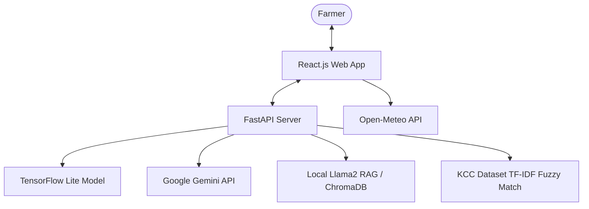
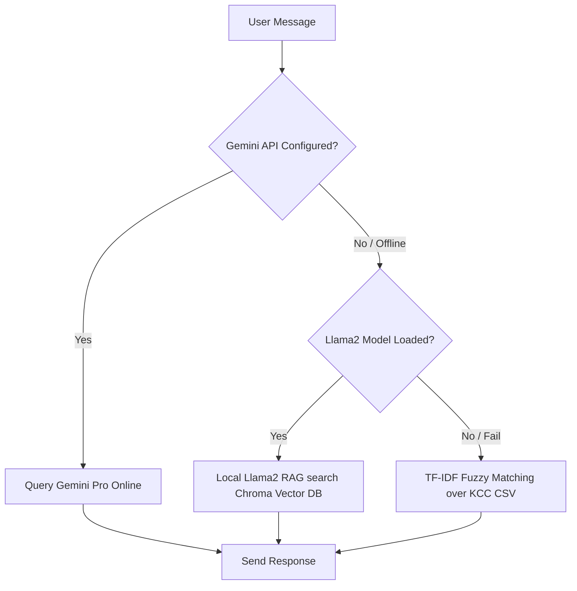

# 🌾 KrishiVed: AI-Powered Smart Agricultural Assistant

[](https://react.dev/)
[](https://fastapi.tiangolo.com/)
[](https://tensorflow.org/)
[](https://opensource.org/licenses/MIT)

**KrishiVed** is an intelligent, multilingual agricultural companion designed to empower Indian farmers. By combining Computer Vision for crop disease detection, Generative AI for agricultural advisory in regional dialects, and real-time market/weather dashboards, KrishiVed acts as a digital "Expert in the Pocket."

---

## 🚀 Key Features

*   **🔬 Crop Leaf Disease Detection**: Upload an image of a diseased crop leaf to get instant classification and actionable remedies. Powered by a custom-trained Convolutional Neural Network (CNN) with **~95% validation accuracy** supporting 73 disease categories.
*   **💬 Multilingual Advisory Chatbot**: Speak or type questions in **English**, **Hindi**, or **Hinglish** (Hindi in English script). It utilizes a multi-tier fallback architecture:
    1.  **Online Mode**: Google Gemini Pro API for fast and highly context-aware responses.
    2.  **Local Offline Mode**: LangChain + Llama 2 (7B quantized) + Chroma Vector DB (RAG) running locally for offline-first resiliency.
    3.  **Fuzzy Keyword Mode**: Scikit-Learn TF-IDF classification + Cosine Similarity matching over a 83MB Kisan Call Center (KCC) historic dataset.
*   **🎙️ Accessibility Features**: Integrated **Speech-to-Text** (voice input) and **Text-to-Speech** (voice output) to make the tool accessible to farmers with lower literacy levels.
*   **📊 Mandi Insights Dashboard**: Provides latest crop arrival prices in the local region (Gwalior, Madhya Pradesh) filtered by commodity (Wheat, Paddy, Soyabean, Mustard, etc.) parsed from Agmarknet API data.
*   **🌦️ Real-Time Weather Forecast**: Integrated with the Open-Meteo API to fetch temperature, wind speed, and weather code conditions to assist in scheduling irrigation/sowing.
*   **📍 Location Auto-Detection**: Uses browser Geolocation and reverse geocoding to automatically resolve the farmer's state and district.

---

## 🏗️ Architecture & Query Flow

### System Architecture


### Chatbot Routing Logic


---

## 📂 Project Structure

```
├── backend/                       # FastAPI Backend
│   ├── knowledge/                 # Specialized JSON agricultural knowledge bases
│   ├── rasa_bot/                  # RASA conversational bot experimental setup
│   ├── convert_kcc_to_rasa.py     # Script to generate training yml files from KCC CSV
│   ├── main.py                    # Main FastAPI application
│   ├── remedy_db.py               # 73-class bilingual remedy mapping
│   ├── llama2_service.py          # Llama2 LangChain service
│   ├── offline_chat.py            # Local ML models, TF-IDF + Cosine Similarity matching
│   ├── train_chatbot.py           # Logistic regression training pipeline for chatbot
│   └── requirements.txt           # Python backend dependencies
├── models/                        # Pre-trained CNN Models
│   ├── labels.txt                 # List of 73 disease class names
│   ├── leaf_disease_model.h5      # Keras deep learning model (151 MB)
│   ├── leaf_disease_model.tflite  # Light-weight TFLite conversion (53 MB)
│   └── checkpoints/               # Resumable epoch checkpoint folders
├── src/                           # React Frontend Source
│   ├── App.js                     # Main landing page and weather/mandi dashboard
│   ├── Chatbot.js                 # Floating chatbot interface with speech capabilities
│   ├── WeatherCard.js             # Weather visualization card
│   └── App.css / Chatbot.css      # Styling sheets
├── .env.example                   # Environment configuration template
├── package.json                   # Node.js dependencies
└── start_backend.bat              # Quick start batch file for Windows
```

---

## 🛠️ Installation & Setup

### Prerequisites
*   Node.js (v18+)
*   Python (3.10+)

### 1. Backend Setup
1.  Navigate to the `backend/` directory:
    ```bash
    cd backend
    ```
2.  Create and activate a virtual environment:
    ```bash
    python -m venv venv
    # On Windows:
    .\venv\Scripts\activate
    # On Mac/Linux:
    source venv/bin/activate
    ```
3.  Install dependencies:
    ```bash
    pip install -r requirements.txt
    ```
4.  *(Optional)* Download the quantized Llama 2 model `llama-2-7b-chat.ggmlv3.q4_K_M.bin` and place it in the path:
    `../End-to-end-Agriculture-Chatbot-using-Llama2-main/model/`

### 2. Frontend Setup
1.  Navigate back to the root directory:
    ```bash
    cd ..
    ```
2.  Install frontend dependencies:
    ```bash
    npm install
    ```

### 3. Environment Variables
1.  Copy the example env file:
    ```bash
    cp .env.example .env
    ```
2.  Open `.env` and fill in your details:
    *   `GEMINI_API_KEY`: Get from Google AI Studio.
    *   `REACT_APP_WEATHER_API_KEY`: Your OpenWeather API key.

---

## 🏃 Run the Application

### Start the Backend
```bash
cd backend
python main.py
```
*The API will start running at `http://localhost:8000` with interactive docs available at `/docs`.*

### Start the Frontend
In another terminal, from the root folder:
```bash
npm start
```
*This opens your browser to `http://localhost:3000`.*

---

## 📈 Model Performance

The deep learning classifier was trained on a comprehensive leaf disease image dataset.
*   **Total Parameters**: 13,252,489
*   **Input Image Shape**: `(256, 256, 3)` (RGB)
*   **Validation Accuracy**: **~95%**
*   **CPU Inference Speed**: ~42 ms/image (~23 FPS)

---

## 👥 Contributors

*   **Aakansha Singh** - Frontend Development & UI Design
*   **Akash Singh** - Machine Learning & Backend Architecture
*   **Vikhyat Wahi** - Data Analytics & Documentation
